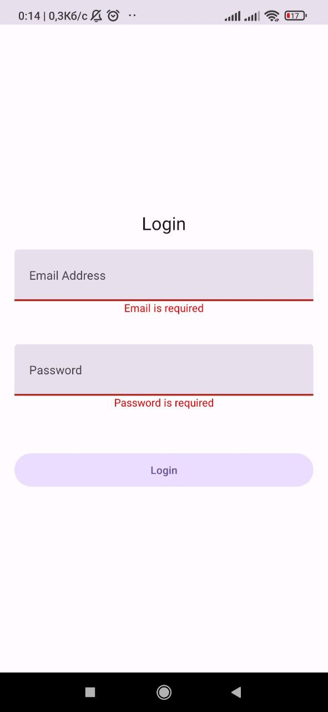

# Authtestapp

Authtestapp is a React Native project built with Expo, designed to showcase authentication functionality. This project uses various popular libraries for state management, navigation, and form validation.

## Description

Authtestapp includes user authentication and other features provided by libraries like Redux, Formik, and Yup. The application is cross-platform and can run on iOS, Android, and Web.

## Installation

1. Clone the repository:

    ```sh
    git clone https://github.com/OliinykViktor/authtestapp.git
    cd authtestapp
    ```

2. Install dependencies using either npm or yarn:

    **Using npm:**

    ```sh
    npm install
    ```

    **Using yarn:**

    ```sh
    yarn install
    ```

## Scripts

- `start`: Start Expo
- `android`: Start the application on Android
- `ios`: Start the application on iOS
- `web`: Start the application in a web browser
- `lint`: Run the linter
- `lint:fix`: Fix linter errors

Usage:

**Using npm:**

```sh
npm run start
```
```sh
npm run android
```
```sh
npm run ios
```
```sh
npm run web
```
```sh
npm run lint
```
```sh
npm run lint:fix
```

**Using yarn:**

```sh
yarn start
```
```sh
yarn android
```
```sh
yarn ios
```
```sh
yarn web
```
```sh
yarn lint
```
```sh
yarn lint:fix
```

## Screenshots

**IOS:**


**android:**





